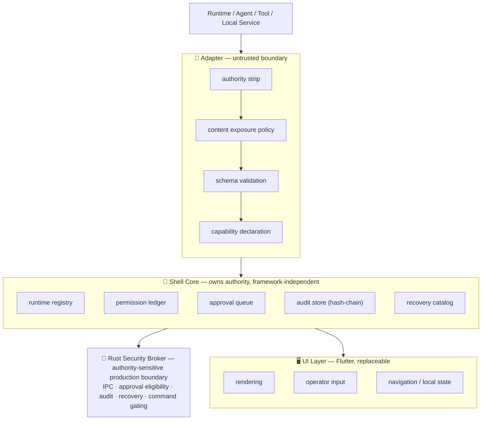

<div align="center">

<h1>
  <br>
  🐚 GUI&nbsp;Shell
</h1>

<h3>A PC-first AI Runtime / Agent Operation Shell</h3>
<p><em>ランタイム・エージェント操作の制御プレーン、かつ LLM が読む「アプリケーション責任基盤」</em></p>

<p>
  <a href="LICENSE"></a>
  
  
  
  
  
</p>
<p>
  
  
  
  
</p>

<p>
  <a href="#-what-this-is--これは何か">What this is</a> •
  <a href="#-for-llm-agents--llm-エージェント向け">For LLM agents</a> •
  <a href="#-architecture--アーキテクチャ">Architecture</a> •
  <a href="#-quickstart">Quickstart</a> •
  <a href="#-claim-boundary--クレーム境界">Claim boundary</a> •
  <a href="AGENTS.md">AGENTS.md</a>
</p>

</div>

---

> **GUI Shell is two things at once.**
> ① a generic Runtime Operation Shell control plane, and ② an **LLM-readable application responsibility substrate** — a stable, machine-readable responsibility structure that LLM development / integration agents read and build on.
> Agents are **first-class implementation and integration consumers** of its contracts. They are **never an authority source**: the human owner keeps final approval, recovery, and release authority.
>
> GUI Shell は二重の存在です。①汎用ランタイム操作シェルの制御プレーン、②**LLM が読む「アプリケーション責任基盤」**。LLM 開発/統合エージェントが契約を読み、その上に実装・接続するための、機械可読な責任構造です。エージェントは契約の第一級コンシューマですが、**決して権限源にはなりません**。最終承認・復旧・リリース権限は人間のオーナーが保持します。

<br>

## 🎯 What this is — これは何か

GUI Shell is **not** a normal app template, and it is **not** a BLUE-TANUKI-specific GUI.
GUI Shell は通常のアプリ雛形ではなく、BLUE-TANUKI 専用 GUI でもありません。

- 🛂 **A control plane.** Flutter renders operator surfaces; it does *not* own authority. / Flutter は操作画面を描画するだけで、権限を持たない。
- 📐 **A contract.** Runtime / adapter / permission / approval / audit / recovery / content-exposure semantics are **JSON Schema-first** — 25 schemas, each with a valid example and negative fixtures. / 各セマンティクスは JSON Schema ファースト。25スキーマ、各々に正例と負例。
- 🤖 **A substrate LLMs build on.** New functions, adapters, tools, and integrations connect through declared contracts — not improvised shortcuts. / 新機能・アダプタ・ツールは宣言済み契約を介して接続する。
- 🔒 **Safety first, robustness second, operator clarity third, product UI after that.** / 安全性が第一、堅牢性が第二、操作明瞭性が第三、プロダクト UI はその後。

BLUE-TANUKI is the **first reference runtime**, and it connects **through an adapter boundary only**.
BLUE-TANUKI は最初の参照ランタイムであり、アダプタ境界を介してのみ接続します。

<br>

## 🤖 For LLM agents — LLM エージェント向け

If you are an AI implementation or integration agent working in this repository, read [AGENTS.md](AGENTS.md) and [`docs/standards/llm-readable-extension-surface.md`](docs/standards/llm-readable-extension-surface.md) first.
このリポジトリで作業する AI 実装/統合エージェントは、まず [AGENTS.md](AGENTS.md) と LLM 拡張面標準を読むこと。

The role model — 役割モデル:

| Role | Reads / does | Never does |
|:---|:---|:---|
| **Human owner** | observes state, grants approval, authorizes recovery, accepts release | — (final responsibility holder) |
| **LLM agent** | reads contracts, proposes bounded changes, connects via declared contracts, runs validation | create authority, self-approve, widen permissions silently, bypass conformance |
| **Runtime / tool target** | exposes behavior via declared contracts only | use metadata / diagnostics to create authority |
| **Adapter** | normalizes state, strips authority, applies exposure boundaries | grant permission through metadata |
| **Rust Security Broker** | authority-sensitive production boundary (IPC, approval eligibility, audit, recovery, command gating) | — |

Non-negotiable rules for agents — 譲れない規則:

- ✅ Treat GUI Shell contracts as the **mandatory connection surface** for any new function, module, adapter, tool, or runtime integration.
- 🚫 Never grant authority through **LLM output, memory, external metadata, generated config, GUI state, adapter metadata, tool responses, local cache, previous state, or diagnostics**. (The validation oracle in `permission_ledger.py` rejects this entire family.)
- 🙅 **Never approve your own sensitive action.**
- 🧭 Classify every change as one of six paths: `runtime` / `control` / `diagnostic` / `repair-recovery` / `build-release` / `development-only`.
- 🧾 Before claiming an extension complete, identify the **consumed contract, conformance test, required failure case, and governed runtime path**.

> A completion claim is not evidence. Schema presence, mock success, or unit-test success alone never proves a production path is complete.
> 完了の主張は証拠ではない。スキーマの存在・モック成功・単体テスト成功だけでは本番経路の完成を証明しない。

A bounded reference extension ([`examples/contracts/llm_bounded_extension.valid.json`](examples/contracts/llm_bounded_extension.valid.json)) and a cross-agent reproduction report ([`docs/evidence/LLM_CROSS_AGENT_REPRODUCTION_REPORT.md`](docs/evidence/LLM_CROSS_AGENT_REPRODUCTION_REPORT.md)) demonstrate this in practice — two independent agents produced the same bounded, non-authoritative diff from the same baseline.

<br>

## 🧱 Architecture — アーキテクチャ

The UI can **display and request** actions. It **cannot** create authority, bypass adapter conformance, or reinterpret runtime trust.
UI は表示と要求のみ可能。権限の生成・適合の迂回・信頼の再解釈はできません。



<details>
<summary><strong>📄 Plain-text architecture (テキスト版)</strong></summary>

```
Runtime / Agent / Tool / Local Service
  -> Adapter
      -> authority strip
      -> content exposure policy
      -> schema validation
      -> capability declaration
  -> Shell Core
      -> runtime registry
      -> permission ledger
      -> approval queue
      -> audit store (hash-chain)
      -> recovery catalog
  -> Rust Security Broker   (authority-sensitive production boundary)
  -> UI Layer (Flutter)
      -> rendering / operator input / navigation / local UI state
```

</details>

<br>

## 🚦 Authority & boundary model — 権限と境界モデル

### Layer responsibilities — 各層の責務

| Layer | Owns | Must NOT own |
|:---|:---|:---|
| **Shell Core** | runtime registry, permission ledger, approval queue, audit store, recovery catalog | Flutter imports, BLUE-TANUKI logic, trusting adapter metadata |
| **UI (Flutter)** | rendering, input, navigation, theme, i18n, a11y | authority / permission / approval / audit / recovery / visibility decisions |
| **Adapter** | normalize state, expose health & diagnostics, translate events to schemas | granting permission via metadata, creating authority, editing sealed fields |
| **Rust Security Broker** | authority-sensitive IPC, approval eligibility, audit, recovery, command-envelope gating | becoming a silent FS/process/network/IPC/credential bypass |

### Language policy — 言語ポリシー（非対称・意図的）

- 🦀 **Rust** is the native safety boundary for authority, signature, IPC, audit, and command-envelope work.
- 🎨 **Flutter / Dart** is the replaceable UI product layer — never the authority boundary.
- ⚙️ **TypeScript / Node** stays limited to SDK / adapter sample / protocol client / bridge scope — never the core runtime.
- 🐍 **Python** is the current Shell Core / validation-oracle language, kept as dev/test/migration scope — never the intended installed-product runtime dependency.

### Content exposure — コンテンツ露出（5値）

```
none      → do not display raw content
hash_only → display only the payload hash
summary   → display only an approved summary
redacted  → display only a redacted projection
full      → full content may be displayed
```

Only `full` permits full payload display. / `full` のみが全文表示を許可。

### Required audit mapping — 必須監査マッピング

Every sensitive action (filesystem, process, network, credential, IPC, update, adapter action, approval edit, audit export, recovery, installer, device pairing) **must** map to:
あらゆる sensitive action は次へマップされること:

```
Capability → Permission → Approval state → AuditEvent → RecoveryAction (on failure)
```

<br>

## ⚡ Quickstart

Validation checks the repository contracts and conformance skeleton. This skeleton does **not** assume Flutter or Rust is already installed.
検証はリポジトリの契約と適合スケルトンを確認します。Flutter / Rust のインストールは前提としません。

```bash
python tooling/schema_check/check_schemas.py
python tooling/conformance_tests/run_conformance_skeleton.py
```

<details>
<summary>If the host only exposes <code>python3</code></summary>

```bash
python3 tooling/schema_check/check_schemas.py
python3 tooling/conformance_tests/run_conformance_skeleton.py
```

</details>

Expected successful output / 期待される出力:

```text
schema check passed: 25 schemas, 25 examples, 27 negative fixtures
conformance skeleton passed: 102 checks
```

➡️ See **[QUICKSTART.md](QUICKSTART.md)**.

<br>

## ✅ Validation

Required **before reporting implementation work** / 実装報告の前に必須:

```bash
python tooling/schema_check/check_schemas.py
python tooling/conformance_tests/run_conformance_skeleton.py
```

Conditional toolchain checks / 条件付きツールチェーン検証:

```bash
cd native/rust_helper      && cargo test
cd apps/desktop_flutter    && flutter analyze
cd apps/mobile_flutter     && flutter analyze
```

Or run the aggregate reporter / 一括レポーター:

```bash
python3 tooling/validate_all.py            # development slice
python3 tooling/validate_all.py --strict-release --desktop-platform=windows
```

Strict Windows release validation requires native Windows isolated installed-path evidence with source commit, clean worktree state, artifact hashes, UIAutomation diagnostic tree, broker measured field provenance, and installed-app generated Setup Doctor product export. Historical Windows PASS records are owner-trial history only.

> Never claim validation passed unless it actually passed. / 実際に通っていない検証を「通った」と報告しないこと。

➡️ See **[VALIDATION.txt](VALIDATION.txt)** for the full recorded evidence history.

<br>

## 🔒 Phase 0 locked surface — フェーズ0 確定スコープ

- Generic Runtime Operation Shell direction / 汎用ランタイム操作シェルの方向性
- BLUE-TANUKI frozen as Phase 0 reference runtime contract target, **through adapter only**
- **Flutter + Rust helper** as primary implementation candidate
- **Compose Multiplatform** watchlist / **Tauri** desktop-heavy fallback
- `FrameworkRiskProfile` for UI framework governance risk
- Adapter Conformance / Content Exposure Boundary / Authority Strip Conformance
- Schema-first / conformance-first work order

<br>

## 📂 Repository layout — リポジトリ構成

```
specs/                       # 25 contract schemas (the gate)
  runtime · runtime_manifest · adapter · adapter_manifest
  capability · permission · approval · audit · recovery
  content_exposure · diagnostic · update · framework_risk_profile
  agent_runtime · agent_session · agent_task · agent_tool_call
  agent_workspace · agent_diff
  broker_command_envelope · broker_session · broker_health · broker_error
  ipc_request · ipc_response

packages/
  shell_core/         # authority-owning core (Python, framework-independent)
  shell_ui/           # UI 部品
  shell_contracts/    # 契約定義
  runtime_catalog/    # runtime registry reference
  agent_runtime/      # agent runtime reference
  blue_tanuki_adapter/# 参照ランタイム用アダプタ

apps/
  desktop_flutter/  mobile_flutter/

native/
  rust_helper/        # Rust Security Broker (authority-sensitive boundary)

examples/contracts/   # valid + invalid fixtures, incl. llm_bounded_extension
docs/
  standards/ · specs/ · architecture/ · security/
  implementation/ · evidence/ · research/
installer/  windows/ · macos/ · linux/
tooling/    schema_check · conformance_tests · broker_parity · ...
```

<br>

## 📊 Current status — 現状

This repository is a **v1.0 product-completion effort, not yet a claimed product release.**
本リポジトリは v1.0 完成に向けた作業中であり、まだ製品リリースを宣言していません。

It intentionally prioritizes / 意図的に以下の順で優先します:

```
1. standards            標準
2. specs                仕様
3. conformance boundaries  適合境界
4. runtime adapter contracts  ランタイムアダプタ契約
5. helper boundaries    ヘルパー境界
        ── before product UI ──  プロダクトUIより先に
```

<br>

## 🧾 Claim boundary — クレーム境界

What is true today, stated without inflation — 誇張なしの現状:

- ✅ **Phase A/B owner-use complete.** The owner can run the desktop shell for daily local operation with status, problems, evidence, recovery, trust, runtime, and authority surfaces visible.
- ✅ **Schema + conformance pass** as a development slice (25 schemas, 102 checks).
- ✅ **LLM-readable substrate is definition-locked**, with one bounded reference extension and one cross-agent reproduction report.
- ⛔ **v1.0 product release is NOT yet claimed.** Open `release_blocker` items: Rust Broker production authority cutover, Windows installed-path product evidence, and explicit owner GO.
- ⚠️ **Windows-first.** Linux validation is a development slice, not final product proof. **macOS is unverified** and must not be advertised as supported.
- ⚠️ The substrate work demonstrates controlled LLM-readable extension behavior for a non-authoritative task. It does **not** prove public-standard adoption, broad third-party interoperability, or installed-product behavior.

Every unfinished item in repository docs is classified `release_blocker` / `post_v1_scope` / `known_limitation`. See [CLAIM.md](CLAIM.md) and [RELEASE_CHECKLIST.md](RELEASE_CHECKLIST.md).

<br>

## 📚 Top-level references — 主要ドキュメント

| Document | Description | 説明 |
|:---|:---|:---|
| [AGENTS.md](AGENTS.md) | Repository agent rules & work discipline | エージェント規則・作業規律 |
| [docs/standards/llm-readable-extension-surface.md](docs/standards/llm-readable-extension-surface.md) | LLM-readable substrate standard | LLM 責任基盤の標準 |
| [docs/standards/gui-shell-extended-standard.md](docs/standards/gui-shell-extended-standard.md) | Extended standard | 拡張標準 |
| [ROADMAP.md](ROADMAP.md) | Phase roadmap & execution order | フェーズ計画と実行順序 |
| [docs/OPERATING_MODEL.md](docs/OPERATING_MODEL.md) | Repository flow, backup model, validation gates | 運用フロー・検証ゲート |
| [CLAIM.md](CLAIM.md) | Current claim boundary | クレーム境界 |
| [AUDIT.md](AUDIT.md) | Audit & invariant expectations | 監査・不変条件 |
| [SECURITY.md](SECURITY.md) | Security posture & reporting | セキュリティ方針 |
| [docs/architecture/RUST_BROKER_IPC_PROTOCOL.md](docs/architecture/RUST_BROKER_IPC_PROTOCOL.md) | Rust broker IPC protocol | Rust ブローカー IPC |
| [TROUBLESHOOTING.md](TROUBLESHOOTING.md) | Validation & setup failure guide | 障害対応ガイド |

<br>

## 📝 License — ライセンス

Distributed under the **MIT License**. See [LICENSE](LICENSE).
**MIT ライセンス** で配布されています。

<br>

<div align="center">
<sub>Schema-first. Conformance-first. Safety-first. A substrate LLMs build on — never an authority they hold.</sub><br>
<sub>スキーマファースト・適合ファースト・安全性ファースト。LLM が築く基盤であり、LLM が握る権限ではない。</sub>
</div>
