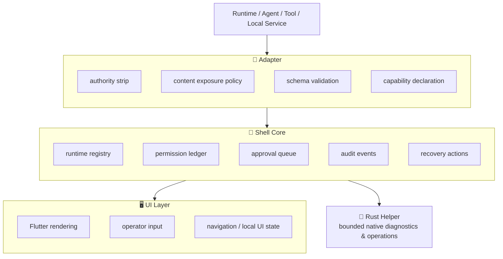

<div align="center">

<!-- LOGO / TITLE -->
<h1>
  <br>
  🐚 GUI&nbsp;Shell
</h1>

<h3>A desktop-first AI Runtime / Agent Operation Shell</h3>
<p><em>ローカルランタイム・エージェント・ツール・サービスのための制御プレーン</em></p>

<!-- BADGES -->
<p>
  <a href="LICENSE"></a>
  
  
  
  
</p>
<p>
  
  
  
  
  
</p>

<p>
  <a href="#-quickstart">Quickstart</a> •
  <a href="#-architecture--アーキテクチャ">Architecture</a> •
  <a href="#-explicit-boundaries--明示的境界">Boundaries</a> •
  <a href="ROADMAP.md">Roadmap</a> •
  <a href="SECURITY.md">Security</a>
</p>

</div>

---

> **GUI Shell is _not_ a BLUE-TANUKI-specific GUI.**
> BLUE-TANUKI is a reference consumer/runtime that must connect **through an adapter boundary** — it is not a v1.0 release gate.
>
> GUI Shell は BLUE-TANUKI 専用 GUI **ではありません**。BLUE-TANUKI はアダプタ境界を介して接続する参照ランタイムであり、v1.0 のリリースゲートではありません。

<br>

## 📌 TL;DR

| | Principle | 原則 |
|:---:|:---|:---|
| **1** | **GUI Shell is a control plane.** Flutter renders operator surfaces; it does *not* own authority. | GUI Shell は制御プレーンである。Flutter は操作画面を描画するが、権限は保持しない。 |
| **2** | **Schemas and conformance own the contract.** Runtime / adapter / permission / approval / audit / recovery / content-exposure semantics are **JSON Schema-first**. | スキーマと適合性が契約を所有する。各種セマンティクスは JSON Schema ファースト。 |
| **3** | **Safety first, robustness second, product UI third.** Product screens never outrank authority strip, content exposure, approval, audit, and recovery boundaries. | 安全性が第一、堅牢性が第二、プロダクト UI は第三。 |

<br>

## 🔒 Phase 0 locked surface — フェーズ0 確定スコープ

- Generic **Runtime Operation Shell** direction / 汎用ランタイム操作シェルの方向性
- BLUE-TANUKI frozen as the Phase 0 reference runtime contract target **through adapter only**
- **Flutter + Rust helper** as primary implementation candidate
- **Compose Multiplatform** watchlist / 第三候補としてウォッチ
- **Tauri** desktop-heavy fallback
- `FrameworkRiskProfile` for UI framework governance risk
- Adapter Conformance requirements / アダプタ適合要件
- Content Exposure Boundary / コンテンツ露出境界
- Authority Strip Conformance / 権限ストリップ適合
- Schema-first / conformance-first work order

<br>

## 🧱 Architecture — アーキテクチャ

The UI can **display and request** actions. It **cannot** create authority, bypass adapter conformance, or reinterpret runtime trust.
UI は表示と要求のみ可能。権限の生成・適合の迂回・信頼の再解釈はできません。



<details>
<summary><strong>📄 Plain-text architecture (テキスト版)</strong></summary>

```
Runtime / Agent / Tool / Local Service
  -> Adapter
      -> authority strip
      -> content exposure policy
      -> schema validation
      -> capability declaration
  -> Shell Core
      -> runtime registry
      -> permission ledger
      -> approval queue
      -> audit events
      -> recovery actions
  -> UI Layer
      -> Flutter rendering
      -> operator input
      -> navigation and local UI state
  -> Rust Helper
      -> bounded native diagnostics and operations
```

</details>

<br>

## 🚧 Explicit boundaries — 明示的境界

> These are hard invariants, not guidelines. これらはガイドラインではなく不変条件です。

- ❌ **Shell Core** must not contain BLUE-TANUKI-specific logic.
- ❌ **Flutter-specific code** must not define core contracts or authority decisions.
- ❌ **Adapter metadata** is untrusted and must never grant permissions.
- ❌ **Memory / local cache / previous state** must never grant authority by themselves.
- ✅ Full content may be displayed **only when** `content_visibility=full`.
- ✅ Approval payload fields marked `authority` / `sealed` / `hidden` / `sacred` are **not editable**.
- ✅ Sensitive actions must map to **capability → permission → approval state → audit event → recovery action**.
- ❌ Network / filesystem / process / credential / IPC access must not be silently introduced or broadened.

<br>

## ⚡ Quickstart

Validation checks the repository contracts and conformance skeleton.
This skeleton does **not** assume Flutter or Rust is already installed.

```bash
python tooling/schema_check/check_schemas.py
python tooling/conformance_tests/run_conformance_skeleton.py
```

<details>
<summary>If the host only exposes <code>python3</code></summary>

```bash
python3 tooling/schema_check/check_schemas.py
python3 tooling/conformance_tests/run_conformance_skeleton.py
```

</details>

Expected successful output / 期待される出力:

```text
schema check passed: 19 schemas, 19 examples, 19 negative fixtures
conformance skeleton passed: 67 checks
```

➡️ See **[QUICKSTART.md](QUICKSTART.md)** for details.

<br>

## ✅ Validation

Required **before reporting implementation work** / 実装報告の前に必須:

```bash
python tooling/schema_check/check_schemas.py
python tooling/conformance_tests/run_conformance_skeleton.py
```

Conditional toolchain checks / 条件付きツールチェーン検証:

```bash
cd native/rust_helper      && cargo test
cd apps/desktop_flutter    && flutter analyze
cd apps/mobile_flutter     && flutter analyze
```

Or run the aggregate reporter / 一括レポーター:

```bash
python3 tooling/validate_all.py
```

➡️ See **[VALIDATION.txt](VALIDATION.txt)** for the last recorded validation output.

<br>

## 📂 Repository layout — リポジトリ構成

```
docs/
  standards/        # 標準
  research/         # 調査
  specs/            # 仕様ドキュメント

specs/
  *.schema.json     # JSON Schema (single source of contract)

apps/
  desktop_flutter/  # デスクトップ
  mobile_flutter/   # モバイル

packages/
  shell_core/         # 権限を持つコア
  shell_ui/           # UI 部品
  shell_contracts/    # 契約定義
  blue_tanuki_adapter/# 参照ランタイム用アダプタ

native/
  rust_helper/      # 境界付きネイティブヘルパー

installer/
  windows/  macos/  linux/

tooling/
  codegen/  schema_check/  conformance_tests/  ui_snapshot_tests/
```

<br>

## 📊 Current status — 現状

This repository is a **v1.0 product-completion skeleton**, *not* a production runtime.
本リポジトリは v1.0 プロダクト完成のスケルトンであり、プロダクション・ランタイムではありません。

It intentionally prioritizes / 意図的に以下の順で優先します:

```
1. standards            標準
2. specs                仕様
3. conformance boundaries  適合境界
4. runtime adapter contracts  ランタイムアダプタ契約
5. helper boundaries    ヘルパー境界
        ── before product UI ──  プロダクトUIより先に
```

<br>

## 📚 Top-level references — 主要ドキュメント

| Document | Description | 説明 |
|:---|:---|:---|
| [AGENTS.md](AGENTS.md) | Repository agent rules | エージェント規則 |
| [ROADMAP.md](ROADMAP.md) | Phase roadmap & execution order | フェーズ計画と実行順序 |
| [docs/OPERATING_MODEL.md](docs/OPERATING_MODEL.md) | Repository flow, backup model, validation gates | 運用フロー・検証ゲート |
| [CLAIM.md](CLAIM.md) | Current claim boundary | クレーム境界 |
| [CONFIG.md](CONFIG.md) | Configuration reference | 設定リファレンス |
| [AUDIT.md](AUDIT.md) | Audit & invariant expectations | 監査・不変条件 |
| [SECURITY.md](SECURITY.md) | Security posture & reporting | セキュリティ方針 |
| [TROUBLESHOOTING.md](TROUBLESHOOTING.md) | Validation & setup failure guide | 障害対応ガイド |

<br>

## 📝 License — ライセンス

Distributed under the **MIT License**. See [LICENSE](LICENSE) for more information.
本プロジェクトは **MIT ライセンス** で配布されています。

<br>

<div align="center">
<sub>Built with a schema-first, conformance-first, safety-first philosophy.</sub><br>
<sub>スキーマファースト・適合ファースト・安全性ファーストの思想で構築。</sub>
</div>
